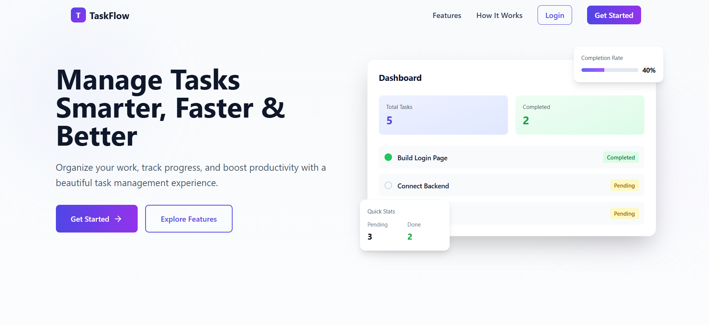
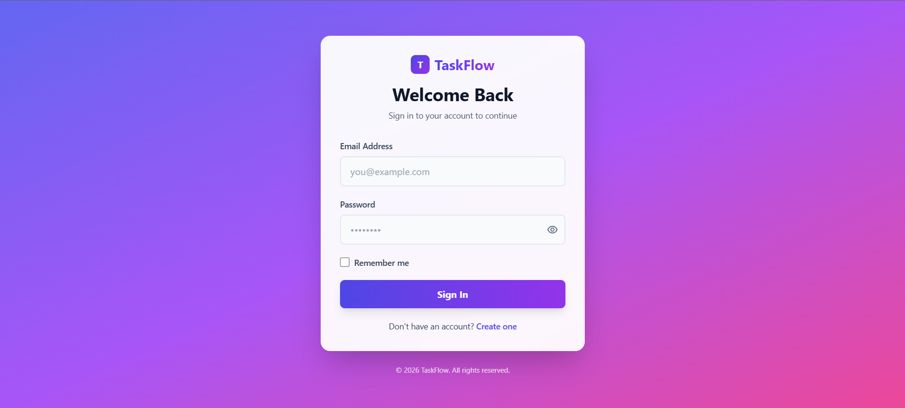
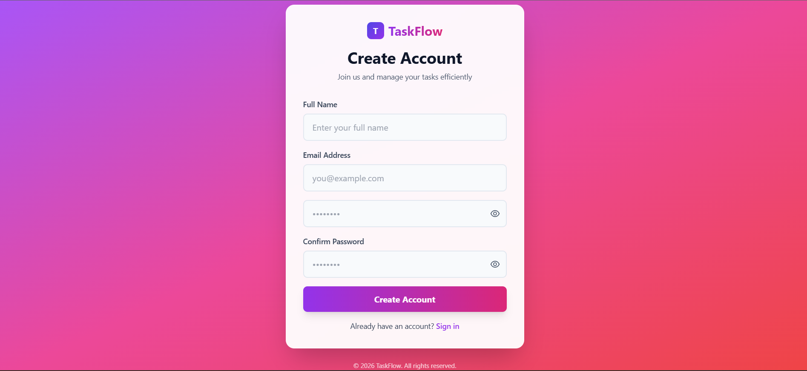
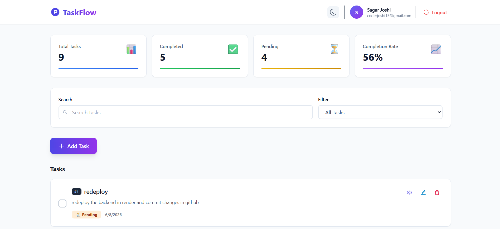
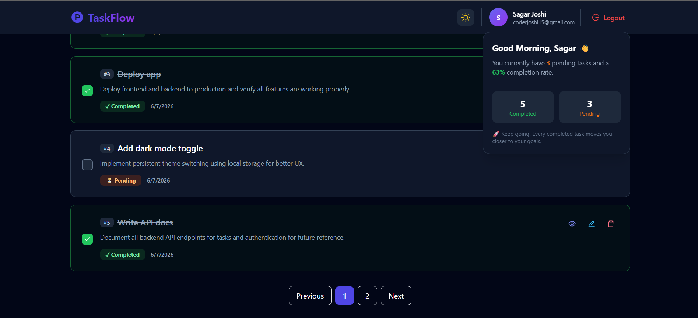
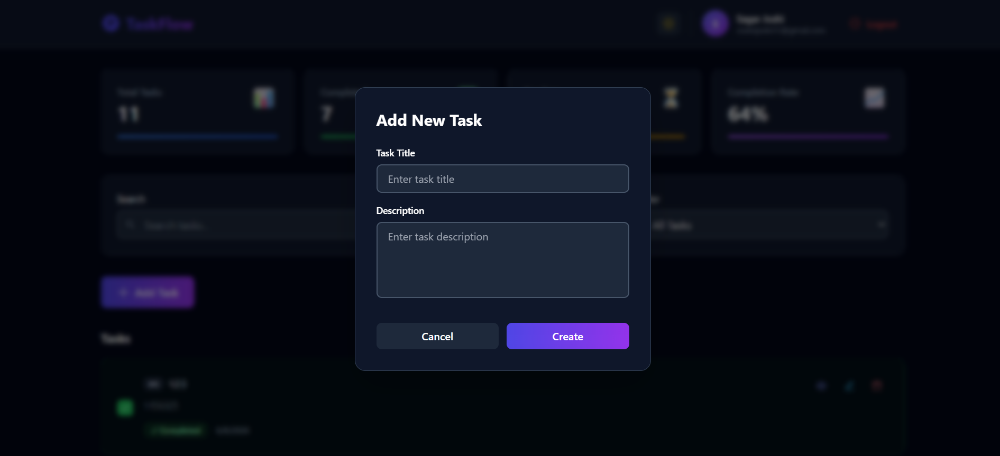
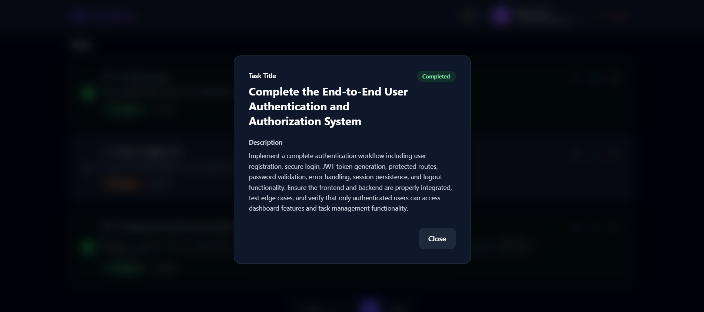
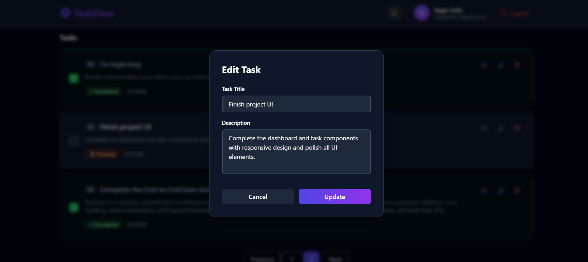
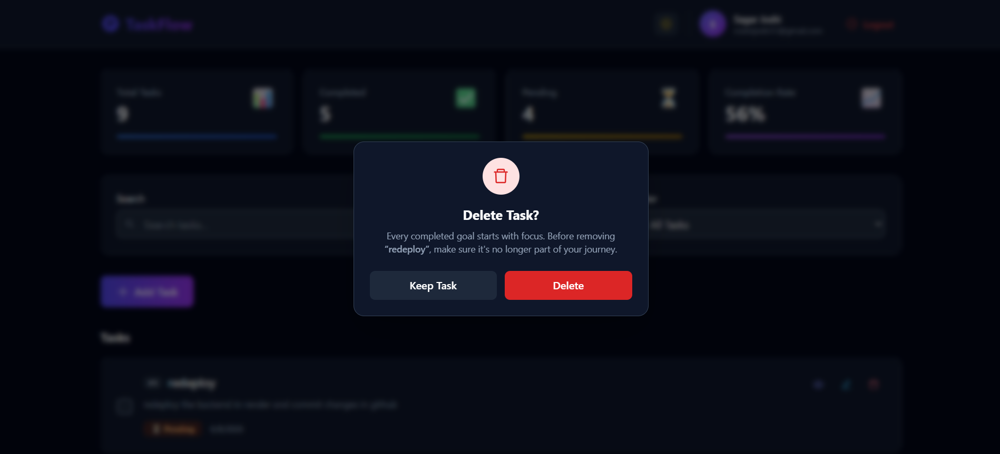

# TaskFlow - MERN Task Management Application

## Live Demo

🔗 https://task-management-web-application-seven.vercel.app/

## Overview

TaskFlow is a full-stack Task Management Web Application built using the MERN Stack (MongoDB, Express.js, React.js, and Node.js).

The application allows users to register, log in securely using JWT authentication, and manage their personal tasks through a modern and responsive dashboard. Users can create, update, delete, search, filter, and track task completion status efficiently.

---

## Features

### Authentication

* User Registration
* User Login
* User Logout
* JWT Authentication
* HTTP-Only Cookie Based Sessions
* Protected Routes

### Task Management

* Create Tasks
* View Tasks
* Edit Tasks
* Delete Tasks
* Mark Tasks as Completed
* Mark Tasks as Pending
* Search Tasks
* Filter Tasks by Status
* Pagination Support

### User Experience

* Modern Responsive UI
* Mobile Friendly Design
* Real-Time Dashboard Statistics
* Smooth Animations using Framer Motion
* Form Validation
* Error Handling

---

## Tech Stack

### Frontend

* React.js
* React Router DOM
* Framer Motion
* Tailwind CSS
* React Icons
* Fetch API
* Dark Mode Support

### Backend

* Node.js
* Express.js
* MongoDB
* Mongoose
* JWT (JSON Web Token)
* bcryptjs
* cookie-parser
* cors
* dotenv

### Database

* MongoDB Atlas

---


## 📸 Screenshots

### 🏠 Home Page


### 🔐 Login Page


### 📝 Register Page


### 📋 Dashboard


### 🌙 Dark Mode Dashboard


### ➕ Add Task


### 👁️ View Task Details


### ✏️ Edit Task


### 🗑️ Delete Task



---

## Project Structure

### Frontend Structure

```bash
task-manager-frontend/
│
├── public/
│
├── src/
│   │
│   ├── api/
│   │   ├── auth.js
│   │   └── task.js
│   │
│   ├── assets/
│   │
│   ├── components/
│   │   ├── DashboardPreview.jsx
│   │   ├── Features.jsx
│   │   ├── Footer.jsx
│   │   ├── HowItWorks.jsx
│   │   └── ScrollToTop.jsx
│   │
│   ├── lib/
│   │   └── utils.js
│   │
│   ├── pages/
│   │   ├── Dashboard.jsx
│   │   ├── Home.jsx
│   │   ├── Login.jsx
│   │   └── Register.jsx
│   │
│   ├── App.jsx
│   ├── main.jsx
│   └── index.css
│
├── .env.development
├── .env.production
├── .gitignore
├── eslint.config.js
├── index.html
├── package.json
└── vite.config.js 
```


### Backend Structure

```bash
task-manager-backend/
│
├── config/
│   └── db.js
│
├── controllers/
│   ├── authController.js
│   └── taskController.js
│
├── middleware/
│   ├── authMiddleware.js
│   └── errorMiddleware.js
│
├── models/
│   ├── User.js
│   └── Task.js
│
├── routes/
│   ├── authRoutes.js
│   └── taskRoutes.js
│
├── utils/
│   └── generateToken.js
│
├── .env
├── server.js
├── package.json
└── README.md
```

---

## Database Schema

### User Schema

```javascript
{
  name: String,
  email: String,
  password: String
}
```

### Task Schema

```javascript
{
  title: String,
  description: String,
  status: String,
  userId: ObjectId
}
```

---

## API Endpoints

### Authentication Routes

| Method | Endpoint           | Description      |
| ------ | ------------------ | ---------------- |
| POST   | /api/auth/register | Register User    |
| POST   | /api/auth/login    | Login User       |
| POST   | /api/auth/logout   | Logout User      |
| GET    | /api/auth/me       | Get Current User |

### Task Routes

| Method | Endpoint              | Description        |
| ------ | --------------------- | ------------------ |
| GET    | /api/tasks            | Get All Tasks      |
| POST   | /api/tasks            | Create Task        |
| PUT    | /api/tasks/:id        | Update Task        |
| DELETE | /api/tasks/:id        | Delete Task        |
| PATCH  | /api/tasks/:id/toggle | Toggle Task Status |

---

## Environment Variables

Create a `.env` file inside the backend folder.

```env
PORT=5000

MONGODB_URL=your_mongodb_connection_string

JWT_SECRET=your_jwt_secret_key

NODE_ENV=development
```

---

## Installation

### Clone Repository

```bash
git clone https://github.com/Sagar10joshi/Task-Management-Web-Application.git
```

---

### Frontend Setup

```bash
cd task-manager-frontend

npm install

npm run dev
```

Frontend runs on:

```bash
http://localhost:5173
```

---

### Backend Setup

```bash
cd task-manager-backend

npm install

npm run dev
```

Backend runs on:

```bash
http://localhost:5000
```

---

## Authentication Flow

1. User registers using email and password.
2. Password is hashed using bcrypt.
3. JWT token is generated after login.
4. Token is stored inside an HTTP-only cookie.
5. Protected routes verify JWT using middleware.
6. Authenticated users can manage only their own tasks.

---

## Advanced Features Implemented

* Search tasks by title/description
* Filter tasks by status (pending/completed)
* Pagination for optimized performance
* User-specific data isolation
* Secure REST API architecture

---

## Security Highlights

* JWT Authentication using HTTP-only cookies
* Password hashing using bcryptjs
* Protected API routes with middleware
* Rate limiting on authentication routes
* Helmet for secure HTTP headers
* CSRF protection implemented
* CORS restricted to trusted origins
* User-specific task access control

---

## Deployment

### Frontend

Deploy using:

* Vercel

### Backend

Deploy using:

* Render


### Database

* MongoDB Atlas

---

## Author

**Sagar Joshi**

Full Stack Developer

Built using the MERN Stack as a modern task management solution.

---

## License

This project is developed for educational and portfolio purposes.
